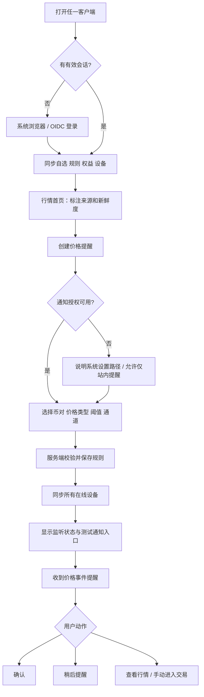
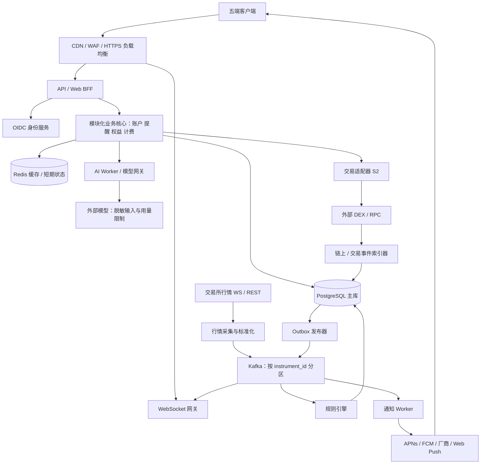
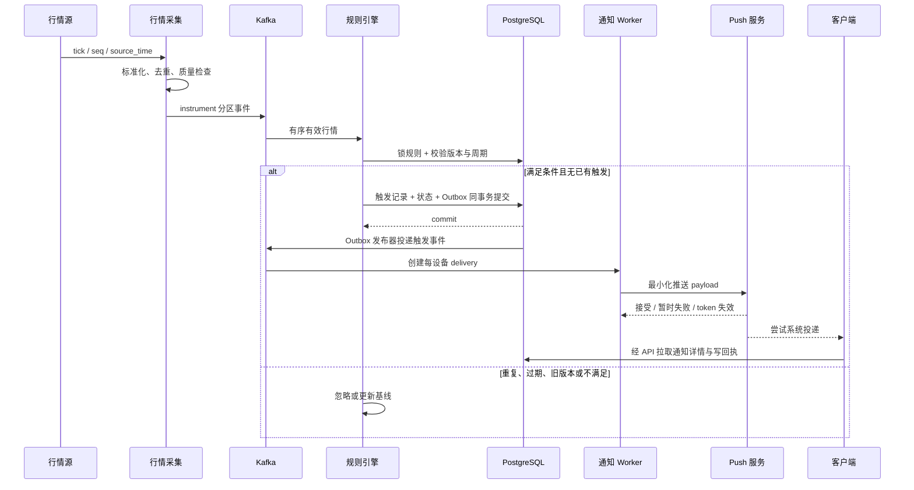
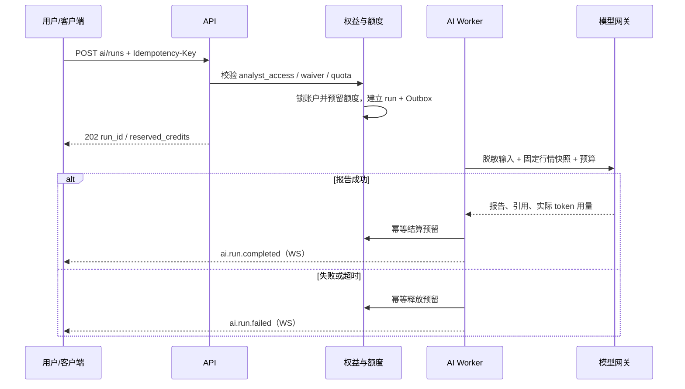
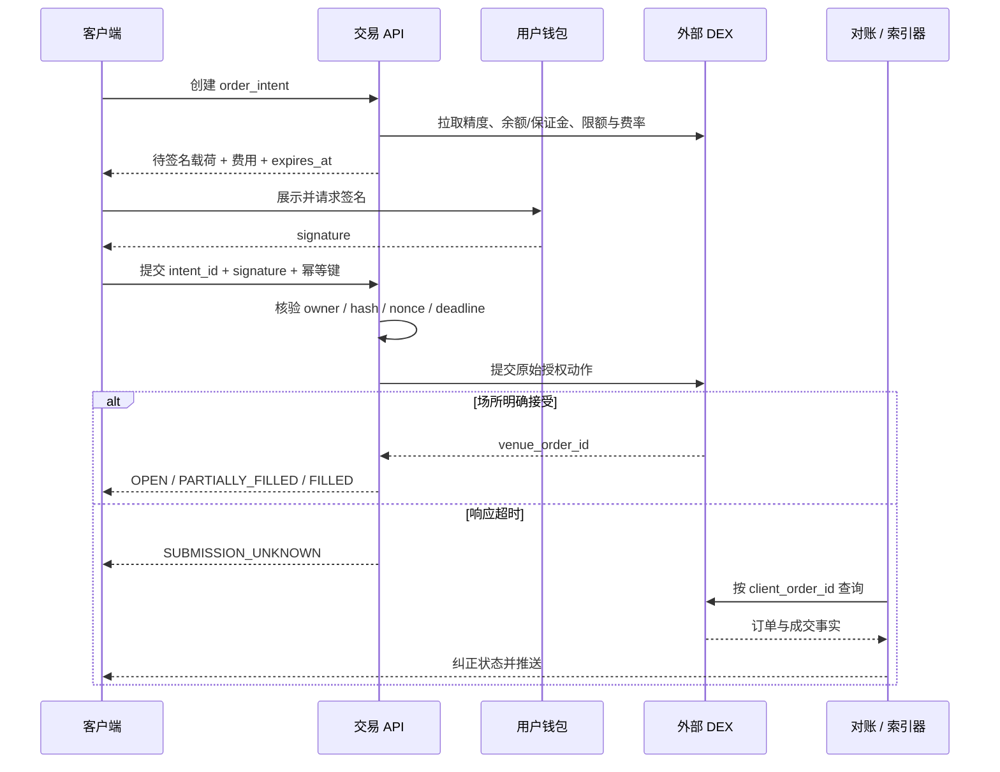
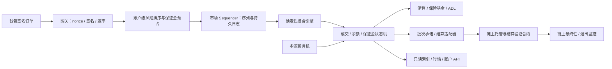

# CoinClock 技术总体设计

版本：0.1 · 日期：2026-09-21 · 状态：待产品与技术评审的设计基线

## 1. 输入、范围与关键假设

### 1.1 已知与未知

用户说明现有产品已经初步实现一个币种的闹钟，需要补齐完整技术方案，计划包含 iOS、Android、Windows、macOS、Web 五个入口。提供的构想截图描述：参考交易平台的交易量阶梯手续费和 VIP；发行平台币；使用平台币购买 AI 分析师使用资格或解锁新分析师；VIP / 创世 NFT 可能免除 AI 使用费用；远期建设类似 Hyperliquid 的 DEX。

本次检查 `D:\Projects\CoinClock` 时目录为空，因此无法确认现有语言、价格来源、闹钟判定方式或任何已实现 API。以下组件、接口、费率和容量都是**建议设计**。不能据此宣称已完成性能验证、审计或交易接入。

### 1.2 默认决策与可替换项

| 决策 | 默认方案 | 如果改变，需要重新设计的部分 |
|---|---|---|
| 首发价值 | 可靠、可解释的价格提醒 | 若首发交易，交付周期与安全投入明显增加 |
| 交易模式 | S2 非托管、接入现有 DEX，先一种交易品类 | 自建 DEX 需 S3 撮合、风险和结算系统，不只是替换 HTTP API |
| 永续合约 | 作为目标能力，先适配一家支持的场所 | 仅做现货可移除杠杆/资金费率/强平部分 |
| 后端 | Java 21 + Spring Boot；版本在立项时锁定受支持版本 | 现有代码不同时先评估复用，本文不要求重写 |
| 价格提醒 | 服务端权威判断；客户端负责提示与展示 | 仅本地判断无法覆盖关闭、休眠和跨端同步 |
| 支付 | S1 服务额度；S2+ 增加平台币链上付款 | 不把链上余额直接当作内部可扣款账户 |
| NFT 免除范围 | 免平台定义的 AI 使用费，仍有公平使用额度 | 若免交易服务费，需新增费率规则；不自动免底层场所或 Gas 费 |
| 随机解锁 | 首版固定价格解锁；随机机制单独立项 | 抽取概率、审计、退款、地区限制、随机数方案均需补齐 |
| 部署 | 单主区域、多可用区；备份到灾备区 | 多地区主动写入会引入金融状态和规则状态冲突 |

“完全免费”在系统中必须对应明确的费用类型、有效期、额度和政策版本。NFT 不等于不限算力；免费权益可以免计价但仍执行速率和并发限制。

### 1.3 分阶段产品范围

| 阶段 | 用户可见功能 | 完成定义 |
|---|---|---|
| S0 闹钟基础 | 登录、多币种行情、自选、价格提醒、五端同步、通知与历史 | 服务端规则可恢复，通知可追踪，五端实际设备验收 |
| S1 AI 与会员 | AI 分析师目录、免费额度、服务额度、会员权益、报告 | AI 无交易执行权限，消耗可退款，结果含数据时间与来源 |
| S2 交易与链上权益 | 钱包绑定、DEX 下单/撤单/持仓、VIP、平台服务费、平台币付款、NFT 权益 | 签名授权、交易对账、链重组和收费对账通过验收 |
| S3 自建 DEX | 撮合、保证金、资金费率、强平、保险基金、链上结算 | 独立立项、经济安全仿真、审计、测试网、资金上限灰度 |

S1 与 S2 可部分并行；“五端入口”是产品目标，每阶段都保留统一协议和能力开关，不等于五个平台同一天发布。

## 2. 功能域与模块拆分

| 模块 | 职责 | 主要数据 / 对外能力 |
|---|---|---|
| 账户与设备 | OIDC 登录、会话、偏好、通知授权、设备撤销 | 用户、设备、通知订阅、会话吊销 |
| 行情 | 交易场所连接、产品目录、标准化价格、K 线、质量检测 | instrument、quote、candle、WS 订阅 |
| 自选与提醒 | 自选分组、规则、规则版本、触发状态、暂停/恢复 | watchlist、alert_rule、alert_trigger |
| 通知 | 多端投递、通道策略、重试、回执、免打扰 | notification、delivery、receipt |
| 钱包与交易 | 钱包证明、签名准备、订单转发、撤单、成交/持仓同步 | wallet、order_intent、order、fill |
| 计费与会员 | VIP、手续费政策、支付订单、服务额度、退款、对账 | fee_policy、volume_bucket、ledger、payment |
| AI 分析师 | 人设/能力目录、解锁、用量、任务、报告、模型路由 | analyst、entitlement、ai_run、report |
| 链上索引 | 区块/事件同步、确认数、重组处理、NFT 持仓 | chain_event、chain_cursor、nft_ownership |
| 管理与风控 | 配置审核、费率发布、限流、熔断、审计、工单 | risk_event、audit_log、feature_flag |

管理员必须通过独立管理入口与独立权限域访问。客户 API 不接受 `user_id` 来决定数据归属，统一从有效身份中取当前用户。

## 3. 五端技术选型与交互

### 3.1 推荐组合

| 层 | 技术 | 原因与边界 |
|---|---|---|
| iOS / Android | Flutter + Dart；Swift/Kotlin 原生插件 | 共用移动 UI，通知、后台、钱包深链、密钥存储仍需原生适配 |
| Web | React + TypeScript + Vite；PWA 可选 | 行情图、交易表单与后台生态成熟；业务 API 使用同源 BFF |
| Windows / macOS | Tauri 2 + React | 复用 Web 页面和 TS SDK，包体较小；Rust 命令采用能力白名单 |
| 图表 | Lightweight Charts 或经许可的金融图表库 | 核验商用许可；数据源与视图库解耦 |
| API SDK | OpenAPI 生成 Dart / TS 客户端 | DTO 和错误码统一；UI 与状态管理按平台实现 |
| 移动状态 | Riverpod / 同类团队熟悉方案 | 登录、连接、规则、通知状态显式管理 |
| Web 状态 | TanStack Query + 轻量本地状态 | 服务端状态缓存与表单状态分离 |
| 本地数据 | 移动 SQLite；桌面 SQLite；Web IndexedDB | 缓存自选、规则只读副本和历史，禁止存助记词或明文 refresh token |

不建议为了共享 UI，把五端强行做成同一种后台保活实现。共用的是业务协议、设计系统和数据模型；系统通知与密钥存储分别验收。若现有闹钟已经使用另一成熟栈，先保持原端实现，用协议迁移衔接。

### 3.2 平台能力矩阵

| 行为 | iOS | Android | Windows | macOS | Web |
|---|---|---|---|---|---|
| 前台价格更新 | WS | WS | WS | WS | WS |
| 后台价格判断 | 服务端 | 服务端 | 服务端 | 服务端 | 服务端 |
| 标准远程提醒 | APNs | FCM；目标市场需要时适配厂商 Push | 系统通知；推送能力依封装与安装方式验证 | 原生通知；远程推送依签名/原生桥验证 | Service Worker + Web Push；依浏览器支持 |
| 本地预定时刻提醒 | 系统通知；支持版本可评估 AlarmKit | AlarmManager，精确权限按资格申请 | 运行中的本地服务/系统任务能力按需求验证 | 系统通知/运行进程调度 | 不能假定关闭页面后本地定时准确触发 |
| 价格触发强制响铃 | 无通用保证 | 无通用保证 | 受静音、休眠、进程状态限制 | 受静音、休眠、进程状态限制 | 受权限、浏览器、系统与自动播放限制 |
| 安全存储 | Keychain | Android Keystore 包装密钥 | OS 凭据库 / DPAPI | Keychain | HttpOnly 会话 Cookie；JS 内存短期状态 |
| 钱包连接 | 深链 / WalletConnect 等 | 深链 / WalletConnect 等 | 外部钱包/二维码 | 外部钱包/二维码 | 浏览器钱包/WalletConnect |

**产品必须区分“价格触发通知”和“定时闹钟”。** 价格触发时间未知，不能提前编程成确定时刻的系统闹钟。APNs 后台静默推送不保证送达，不能用它轮询行情或保证唤醒后响铃。AlarmKit 管理预定时间的闹钟，不能自动赋予任意远程价格事件可靠唤醒能力。iOS Critical Alerts、Android 全屏通知/精确闹钟等均受平台资格和授权约束，不作为默认承诺。

### 3.3 页面与交互状态

- 行情页：自选、搜索、币对/场所筛选、价格来源、更新时间；断流时明确显示“行情过期”，不能继续闪烁为实时价格。
- 提醒编辑页：币对、来源、价格类型、方向、阈值、一次/重复、冷却、重新武装区间、通知设备、免打扰行为；保存前展示一句自然语言确认，例如“OKX BTC/USDT 最新成交价从下方穿越 70,000 USDT 时提醒”。
- 提醒列表：监听中、暂停、待恢复、已完成、行情不可用；支持暂停和删除，跨端冲突提示刷新后重试。
- 通知中心：触发价格/时间/规则快照、查看、确认、稍后提醒、跳行情。确认只表示用户处理，不改变已触发事实。
- 交易页：钱包、网络/场所、可用保证金、价格、滑点、费用明细、签名、订单状态；数据过期时禁用提交。
- AI 页：分析师、费用/权益、数据快照时间、任务进度、报告来源、历史；额度不足进入付款/解锁。
- 设置页：通知测试、每设备授权、免打扰、时区、账户安全、设备会话、钱包解绑、隐私/账户删除。

### 3.4 五端用户主流程

提醒不会自动触发下单；若未来支持策略交易，必须新增明确授权、额度、风控与撤销机制。

## 4. 服务器架构

### 4.1 逻辑架构

行情数据面和业务控制面分开，AI 和交易异常不能阻塞提醒。Kafka 至少一次投递；PG 唯一键和事务保证一次业务效果，不宣称跨推送服务的 exactly-once。

### 4.2 部署建议

生产以 AWS 为参考，可映射至其他提供相同能力的云；区域按用户分布、交易场所连通性、数据驻留和运营要求确定，不能仅因价格选择。

| 区域/网络 | 部署组件 | 访问约束 |
|---|---|---|
| 公网边缘 | CDN、WAF、负载均衡 | 仅开放 HTTPS/WSS 443，HTTP 重定向 |
| 私有应用子网，至少 2 AZ | API/BFF、WS、行情 Worker、规则 Worker、通知 Worker | 仅接收 LB 或受控服务流量；容器无公网 IP |
| 私有数据子网 | PostgreSQL Multi-AZ、Redis 主从、托管 Kafka | SG 限制应用身份；无公网入口 |
| 受控出网 | NAT / 出口代理、DNS 策略 | 仅到配置的行情、推送、模型、RPC 主机 |
| 运维域 | SSO / VPN / 临时访问代理、监控 | 无公开 SSH；操作审计；生产权限限时授予 |
| 灾备区 | 加密备份、对象存储副本、IaC | 只在演练/灾难切换启用写入，防双主 |

初期使用 ECS/Fargate 或同等托管容器，不要求先建设 Kubernetes。API 与 WS 可来自同一代码仓库但独立扩容；规则引擎、行情采集、通知按 Worker 进程部署。Kafka 使用托管集群，消息的副本策略采用 3 副本、`acks=all`、适用时 `min.insync.replicas=2`；若云产品参数不同则选等价耐久级别。

开发环境可用 Docker Compose 单实例；开发拓扑不作为生产高可用方案。S0 低预算试用允许 Outbox + PG 作业队列，仍保留流适配接口；本文的生产容量和回放语义以 Kafka 方案为基线，不能直接套用到简化版。

### 4.3 技术栈决策表

| 组件 | 推荐 | 选择原因与取舍 |
|---|---|---|
| API / 业务 | Java 21 LTS + Spring Boot 的受支持稳定线 | 事务、鉴权、审计和金融数值生态；补丁版本由锁文件/SBOM 固定 |
| 行情接入 | Reactor Netty / 官方 WS 客户端 | 长连接、背压和重连；阻塞任务不放 event loop |
| 数据访问 | SQL/jOOQ 或 MyBatis，统一迁移 Flyway | 明确锁、索引、查询计划；金融写入不用隐式级联 |
| 主数据 | PostgreSQL | 事务、约束、JSONB、分区；账务只写主库 |
| 缓存 | Redis 托管 HA | 行情快照、限流、临时凭证；不作余额真相来源 |
| 事件 | Kafka 兼容托管服务 | 分区内有序、回放、独立消费者；有成本和运维负担 |
| 历史大数据 | 初期 PG K 线 + 对象存储；规模后 ClickHouse | 不将所有 tick 永久塞进事务库 |
| 对象 | S3 兼容对象存储 | 报告、归档、签名安装包、备份；默认私有 |
| 身份 | 托管 OIDC，或独立维护 Keycloak | PKCE、MFA、设备/会话能力；自建身份有升级成本 |
| 可观测 | OpenTelemetry + Prometheus/Grafana + 日志平台 | trace_id 贯穿 API、触发、推送与外部请求 |
| IaC / 发布 | Terraform + CI/CD，签名镜像、制品仓库 | 环境可复现、权限清晰、版本可回滚 |
| S3 撮合 | Rust / Go 候选，经基准后决定 | 与 Java 业务面隔离；必须先验证确定性和尾延迟 |

## 5. 行情与闹钟引擎

### 5.1 数据定义与质量

产品唯一键为 `(venue, market_type, base_asset, quote_asset, settlement_asset)`；`BTC/USDT` 与 `BTC/USD`、现货与永续不能混用。规则必须绑定 `instrument_id` 和 `price_type`：`LAST`、`MARK`、`INDEX`，首版可仅开放 LAST。永续强平风险参考标记价；普通成交价提醒不等于强平预警。

每个标准化 tick 包含 `event_id`、`instrument_id`、`price_type`、`price`、`source_ts`、`received_at`、`stream_epoch`、`sequence`、`quality`、`source`。价格使用十进制；外部无序列号时适配器分配 epoch 内单调序号。每个行情分片使用有 fencing 的租约确保同一时段单写；Kafka key 为 instrument_id，严格按分区消费。

价格新鲜度首版默认上限 5 秒，校验源时间与接收时间的偏差。超时、乱序、异常跳变或重连缺口时标记 STALE / GAP / SUSPECT；不使用旧价格触发新提醒。跳变阈值按品类配置，不能以固定百分比屏蔽真实快速行情。可用第二来源做质量诊断，但不可静默将用户选定场所切换为另一场所触发。

### 5.2 规则语义

| 字段 | 语义 |
|---|---|
| `direction` | ABOVE / BELOW |
| `trigger_mode` | CROSS：穿越；LEVEL_ONCE：创建后下一个新鲜 tick 达标可触发 |
| `repeat_policy` | ONCE / REARM；ONCE 触发后变 COMPLETED |
| `threshold` | 目标价，正数，遵守产品价格精度 |
| `hysteresis_bps` | 重复提醒回到反向区间才重新武装；1 bp = 0.01% |
| `cooldown_seconds` | 两次业务触发最短间隔；推荐默认 300，允许范围由套餐规定 |
| `expires_at` | 可选绝对 UTC 失效时刻 |
| `delivery_policy` | ALL_DEVICES / SELECTED_DEVICES；免打扰 DEFER / SILENT / ALLOW |
| `version` | 编辑 CAS 版本；规则内容变更后重新建立基准价格 |

CROSS ABOVE 的条件为 `previous < threshold && current >= threshold`；CROSS BELOW 为 `previous > threshold && current <= threshold`。没有有效 previous 时只建立基线，不把创建前已发生的穿越补成新事件。LEVEL_ONCE 允许首次有效 tick 达标触发，但同一规则周期仅一次。

REARM ABOVE：价格回落到 `threshold × (1 - hysteresis_bps/10000)` 以下或等于该值，且冷却结束，才切回 ARMED；BELOW 反向对称。处于 WAIT_REARM 时达到目标价格不能反复通知。回落发生在冷却期间时记录条件，冷却结束仍在回落区才武装；若期间已经反弹，则继续等待下一次回落。界面必须展示此语义。

默认跨断流不推断穿越：恢复后的首个有效 tick 作为新基线；必要时显示“断流期间可能发生穿越”。可另立“恢复后已达价通知”产品能力，以独立事件类型展示，不能伪造历史触发时间。触发包含规则版本、当时阈值、价格来源和行情时间，后续编辑不篡改历史。

### 5.3 并发、持久化与恢复

1. 规则写入 PG，事务内同时写 `outbox_event`。API 返回配置已保存；`activation_status=PENDING` 表示引擎还未加载。
2. 规则 Worker 收到版本事件后从主库读权威配置、建立基线，提交 activation revision，推送 `alert.activated`。延迟超过 10 秒进入告警并在客户端显示等待状态。
3. 按 instrument 分区持有规则索引；阈值有序结构定位受跨越价格影响的规则，避免每个 tick 扫所有用户。
4. 触发时 PG 事务锁定规则行并检查 `status=ACTIVE`、版本、周期和 fencing owner；插入唯一 `(rule_id, rule_version, cycle_no)` 触发事件，更新持久化状态，写通知 Outbox。
5. 普通 tick 的 previous 可在内存，边界状态、触发计数、基线检查点必须持久化；每分片定期记录 Kafka offset 检查点。恢复从已提交检查点回放，依唯一键避免重复业务触发，然后推进 offset。
6. 暂停与触发并发时，以 PG 行锁事务提交顺序为准：暂停提交之前已成立的触发保留；暂停提交后旧版本不能创建新触发。推送可能已在途，UI 不承诺撤回已发送通知。
7. Kafka 保留窗口内回放；超过窗口或跨源断连则标记 GAP 并重新建立基线。超出通知 TTL 的历史回放事件只记录为 missed，不在数小时后制造“刚触发”的紧急提醒。

`activation_status` 与用户配置 `status` 分开；数据源 STALE 是运行质量状态，不应悄悄把规则改成 PAUSED。

### 5.4 价格到通知时序

图中客户端访问 DB 的箭头表示经受鉴权 API 的业务调用，不开放直连数据库。

### 5.5 通知策略

通知任务是用户级，delivery 是设备级。默认 ALL_DEVICES，允许用户选择手机/桌面；用户确认后其他在线端显示已处理，已经送出的系统通知按平台支持尽力撤除。系统回执定义为 `PROVIDER_ACCEPTED`、`CLIENT_RECEIVED`、`DISPLAYED`、`OPENED`、`ACKNOWLEDGED`；没有可观察回执就保存 UNKNOWN，不能把供应商接受当作已展示。

推送仅含 opaque notification_id、event_id、通用标题和可选用户允许显示的币对；锁屏默认隐藏价格/资产信息。客户端去重 event_id；服务端 delivery 唯一键避免常规重复，但第三方投递超时仍可能重复。采用指数退避 5s / 30s / 120s，加抖动；通知过期后结束重试；无效设备 token 立即停用。

免打扰使用用户 IANA 时区，跨夏令时由时区库处理。DEFER 推迟到安静时段结束，但若超过最大通知寿命（示例 15 分钟）则只保留历史；SILENT 不播放声音；ALLOW 仅代表本应用允许发出声音请求，仍受系统策略约束。稍后提醒是基于同一事件的新计划投递，不重新判定市场，也不增加原规则触发次数。

## 6. AI 分析师、会员和平台币

### 6.1 分析师模型

分析师是有版本的配置：名称、头像、市场范围、系统提示词版本、可用工具、模型路线、单次额度、并发和报告格式。用户“解锁分析师”获得 `ANALYST_ACCESS` 权益；“免使用费”是 `AI_USAGE_WAIVER`；“平台交易服务费优惠”是独立 `TRADING_FEE_DISCOUNT`。禁止一个 boolean `is_vip` 承载全部业务。

AI 仅调用允许列表内的行情/新闻/研究工具，输入包含固定数据快照与时间。报告给出引用、观测窗口、风险、推断与事实区分。模型输出不作为价格真相、VIP 计算来源或资金账本，不包含私钥，不直接获得交易适配器凭据。

### 6.2 使用与扣费

1. 用户选择分析师与币对，服务器计算实际权益、版本和预估服务额度；需要购买时返回可支付 quote。
2. 提交 AI 任务时带幂等键；PG 原子预留额度 + 建立任务 + Outbox。权益免费也生成零费用使用记录，并执行公平使用限额。
3. Worker 设置超时和 token 预算。输入 prompt 视为不可信，不允许任意 URL 获取或执行代码。
4. 成功后按预先告知的计费模式结算：首版建议固定每报告额度，失败全额释放。若以后按 token 计费，预留上限、最终计价和退款算法须单独版本化。
5. 网络重试返回同一 run_id；客户端断开不自动退款，任务终态决定结算。模型供应商失败记录 provider_error，允许一次受限重试，避免无界烧费。

### 6.3 VIP 与费率

默认依据过去滚动 30 天的**已确认成交 USD 名义额**计算。自成交、回滚、异常刷量或不符合规则的成交不计入；汇率按成交时快照记录，永久可追溯。永续按名义额计算而非保证金；多交易场所合并是否允许由政策规定。每小时更新快照；前台显示计算时间与窗口。

费率通过不可变 `fee_policy_version` 发布；变更走四眼审批。交易确认展示 maker/taker 场所费、平台服务费、预估 Gas，以及折扣适用对象。接入外部 DEX 时遵守其收费授权机制，例如 Hyperliquid builder fee 需要主钱包批准；VIP 可减少平台 builder/service fee，不能改写场所基础费率。NFT 的 AI 免费权益不默认影响交易费。

示例业务费率仅用于演示：VIP0 平台服务费 2 bps，VIP1 为 1.5 bps，VIP2 为 1 bp。规则用整数微基点或高精度 numeric 存储，接口统一 bps 字符串，禁止混用 `0.02`、`0.02%` 和 `2bps`。

### 6.4 分析师抽卡/随机解锁（后续专项）

截图中的“抽卡游戏”如果落地，不能复用普通购买接口，也不能把伪随机结果直接写进客户端。每个卡池要有不可变 `pool_policy_version`：卡池开放时间、分析师列表、稀有度、单次消耗、各结果概率、重复处理、保底计数、免费/付费券类型和终止时间。每次抽取保存 `draw_id`、用户、quote/payment、政策版本、承诺随机数、结果 hash、结果、时间和发放的权益事件；服务端用 CSPRNG 或经审计的可验证随机方案，具体验证方式随链和地区定稿。

实现前必须确认目标地区是否允许这种付费随机机制、是否需要概率公示/年龄限制/消费限额/退款和冷静期。默认不在 iOS/Android 首版提供付费随机抽取，避免把平台币支付与商店数字商品政策混在一起。首发采用固定价格解锁；未来可以提供“选择分析师”和“随机卡池”两条明确路径，UI 展示重复结果、保底进度和预期消耗，不承诺投资回报或稀缺资产价值。NFT 免除 AI 使用费不等于免除随机抽取成本，除非新的政策版本明确写出。

### 6.5 平台币支付与 NFT

平台币符号、总量、链、分配、锁仓和经济模型均未提供，本方案使用 `PLATFORM_TOKEN` 占位符，不创造发行参数。S0/S1 可先使用不可转让的服务额度，平台币上线后增加支付适配器，服务额度不宣称是链上代币余额。

链上付款采用 `payment_quote → wallet transaction → chain pending → confirmed → entitlement/credit grant`。报价固定 chain_id、token 合约、原子单位 amount、收款合约、支付用途、nonce、到期时间。ERC-20 等授权限制金额；禁止无限授权作为默认流程。支付合约/收款事件必须绑定 payment_id，服务端通过自有或可信 RPC 核验事件，不信任前端提交的交易哈希即到账。

确认阈值和 finality 按选定链配置；按 `(chain_id, tx_hash, log_index)` 去重。未确认支付不发可用额度。链重组导致已确认事件撤销时冻结尚未消费的相关权益、走补偿分录与人工复核，不能删除账本或让余额悄悄变负。过期报价到账、付错资产和重复付款进入异常对账，不自动重复发权益。

NFT 权益来源需要钱包所有权证明和确认后的合约持仓。绑定钱包不等于永久拥有 NFT；转移后撤销新任务资格。多钱包归属在账户范围唯一，不能让一个 NFT 同时给多个账号发权益。是否允许转让后重复领取“终身解锁”必须写进政策；默认免使用费随持有状态变化。对超长 AI 任务，以任务预留时的有效权益快照完成本次任务，不追溯加价。

## 7. 交易接入与自建 DEX

### 7.1 S2：非托管交易适配层

服务端保存订单、成交和持仓镜像，不保存用户私钥/助记词，也不把镜像余额当作资产账本。用户资金留在其钱包或选定协议账户中；充值、跨链或授权在钱包中明确展示并签名。产品不提供平台托管充值地址或平台代持提款能力作为隐含默认项。

交易流程：获取有效行情与风险参数 → prepare 订单意图 → 服务端验证限额/费率 → 返回**场所规定格式**的待签名载荷 → 用户钱包签名 → 提交完全一致的载荷 → 场所确认 → WebSocket/轮询同步成交 → 对账确认。EVM 绑定身份可用 EIP-4361，订单签名必须遵循具体协议，不能假定所有场所通用 EIP-712 结构。

订单意图绑定 user、wallet、venue、instrument、side、size、limit、reduce_only、slippage、nonce、deadline、fee_policy_version、最大费用和 payload_hash。提交后端重新计算哈希和验证签名，不能只验证“签名合法”就接受前端改写金额/收款地址。

外部超时的订单进入 `SUBMISSION_UNKNOWN`；先按 client_order_id 或场所请求标识查询，再决定是否重试。未知状态不创建另一笔订单。若场所没有原生幂等及可靠查询，则串行化账户提交流程并在无法确认时停止新提交，不能把本地幂等当作外部已幂等。

撤单有成交竞争：撤单成功不代表零成交，以 fill 事实计算剩余量；修改订单按场所语义明确是 amend 还是 cancel-replace。杠杆设置、保证金变更、资金转出是独立签名动作和独立权限，不借用下单授权。

默认采用逐单钱包签名。未来引入会话/代理密钥时，必须由协议实际支持交易范围、限额、到期和撤销；无提款权限和短时效是要求，不能仅靠客户端隐藏按钮实现。

### 7.2 S3：自建 DEX 的目标拓扑

这是“链下撮合 + 链上结算”的候选架构，不等同于 Hyperliquid 的共识和自有链。完全链上订单簿、自建 L1、有效性证明或乐观结算属于不同方案，不能在没有共识/证明设计的情况下声称去中心化、安全等价或无需信任。

必须明确处理：

- **排序与撮合**：价格/时间优先规则，最小变动单位，订单类型，自成交防护，撤单序列；WAL 在确认前持久化；快照 + 日志回放，备机单主 fencing，确定性状态哈希。
- **跨市场保证金**：按账户串行预占信用，避免同一保证金被多个市场重复使用；跨仓与逐仓分开。成交后释放预占/更新持仓，失败有可重放补偿。
- **风险数学**：权益约等于抵押品折扣价值 + 未实现盈亏 - 应付费用/资金费；初始/维持保证金按阶梯名义头寸计算。不能仅用 `notional/leverage` 一个公式处理全部产品；币本位、线性、组合保证金要分别建模与仿真。
- **标记价与预言机**：多源加权、离群处理、停滞熔断、源失效退化；展示成交价、指数价和标记价。预言机失效时限制增加风险，并保留可安全执行的减仓/撤单路径。
- **清算**：部分清算、拍卖/接管机制、滑点上限、保险基金、穿仓、ADL 排序与用户说明；极端行情和相关资产同时下跌仿真。
- **资金费率**：观察窗口、计算上限、结算时间、舍入方式与历史可重放；每期唯一编号，重复结算无法重复扣款。
- **合约与托管**：资产进入合约后的提款权、结算证明/争议机制、管理员权限、多签/延时升级、紧急暂停与退出；跨链桥引入单独威胁模型。
- **资金守恒**：所有撮合、清算、资金费和退款通过复式账本；总用户权益与链上托管余额/应计项按资产对账。

进入开发前必须定稿《交易规则》《保证金与清算公式》《结算/退出协议》《威胁模型》四份专项规格。本文给出完整系统边界和拆分，不替代这些决定资金安全的形式化规范。S3 不沿用 S2 的外部场所镜像表作为自身资金真相。

## 8. 安全设置与信任边界

### 8.1 基线参数

| 领域 | 建议设置 | 执行位置 |
|---|---|---|
| 传输 | TLS 1.2 最低、优先 1.3，HSTS；内部数据库/消息服务 TLS | LB / 服务客户端 |
| Native 身份 | OIDC Authorization Code + PKCE S256，系统浏览器，state/nonce，严格 redirect URI | IdP + 客户端 |
| Web 身份 | BFF 持有 OIDC token；Cookie Secure/HttpOnly/SameSite=Lax；写操作 CSRF token 与 Origin 检查 | BFF |
| Token | access 建议 10 分钟；refresh 轮换、复用检测；空闲 7 天/绝对 30 天示例 | IdP 策略，按产品调整 |
| 敏感操作 | 新钱包绑定、会话密钥授权、管理员费率发布强制近期 MFA/Passkey | API / IdP |
| 密码 | 交给 IdP；若提供密码登录采用 Argon2id/IdP 安全默认、泄漏密码检查 | 不自行实现加密密码字段 |
| API 权限 | 所有对象做 owner 检查；后台 RBAC + 二人审批；订阅 WS 私有频道同样检查 | 业务层 |
| 限流 | 用户读 120/min、写 30/min；IP 防刷；交易和 AI 单独额度；返回 Retry-After | 网关 + Redis 原子计数 |
| WS | ticket 单次有效 30 秒；用户最多 5 连接、每连接 50 行情订阅初值 | WS 网关 |
| 浏览器 | CSP 无 unsafe-eval，尽量 nonce 脚本，frame-ancestors none；CORS 明确允许来源 | 边缘 / BFF |
| 密钥 | 云 Secret Manager / KMS；服务账号短期凭证；禁止进代码/日志/包内 | CI 与运行环境 |
| 存储 | 云盘/对象/数据库加密；push token、钱包资料等按需字段加密，密钥版本化 | 数据访问层 |
| 网络 | DB/Redis/Kafka 不对公网；私有子网；出网域名白名单 | IaC / SG / 代理 |
| 上传 | S0 默认不开放用户文件；需要时限大小/MIME、独立域、扫描 | 文件服务 |
| 桌面 | Tauri capability 最小化；禁止任意 shell、任意 URL、任意文件写入 | Rust bridge / CSP |
| 制品 | macOS 签名公证、Windows 代码签名、移动正式签名；更新清单与包验签 | 发布流水线 |

数字是设计初值，应在真实使用与负载测试后调整，不是安全保证。对于管理员、签名和金融请求，权限服务/会话吊销缓存不可用时拒绝敏感操作；公开行情允许受控降级。

### 8.2 具体威胁与对策

| 威胁 | 防护与测试 |
|---|---|
| 用户修改 ID 读取别人提醒/报告/订单 | 统一 owner 查询条件；集成测试覆盖所有 GET/PATCH/DELETE 和 WS |
| 推送 token 注册到错误账号 | 必须有效会话；设备安装 ID 与 token 唯一归属；账号切换撤销旧订阅 |
| 被盗钱包签名重放 | 域名/chain/用途绑定、随机 nonce、短 TTL、消费记录；绑定与交易签名不通用 |
| 收费金额/订单载荷被替换 | 服务端签名报价、意图哈希、到期时间、重算费用、幂等记录 |
| 双扣服务额度 | PG 行锁/条件更新 + 唯一业务流水 + 平衡分录；Redis 锁不能替代事务 |
| webhook 伪造 / 重放 | 校验原始 body 签名、时间窗口和事件唯一键；随后对供应商查询核验关键状态 |
| AI 提示注入 / 数据泄漏 | 工具允许列表、固定 JSON schema、脱敏、禁止读取凭证；输出转义防 XSS |
| 行情操纵 / 源故障 | 源标识与数据质量、可观测 gap、多源诊断；风控不用单条未验证成交价 |
| 供应链攻击 | 依赖锁定、SCA、SBOM、签名制品、最小 CI 权限；发布审批 |
| 内部修改费率/NFT 权益 | 版本化配置、双人审批、不可变审计、可回滚政策但不重写旧流水 |
| Web Push endpoint 被用来 SSRF | 仅接受支持供应商的 HTTPS endpoint；拒绝私网/保留地址/重定向，出口代理复验 DNS |

### 8.3 隐私与数据治理

公开钱包地址与账号绑定后视为敏感关联数据；默认不在日志打印完整地址、邮件、token、签名或 AI 原文。审计记录 actor、action、资源 ID、请求 ID、前后值摘要和审批链。资金/收费相关记录按适用保存义务保留；账户删除先撤销会话、推送与活跃规则，再匿名化可删资料，明确不可立即删除的账务记录。

五端采用相同账户与权益服务，但应用内数字商品购买是否需走 Apple / Google 支付，必须按实际销售地区、分发方式和当期商店规则确定。设计中保留 App Store / Play 收据适配器与服务器验签，不默认用平台币绕过应用内购买要求。退款/撤销收据通过幂等事件回收未消费权益。

## 9. 官方依据与需要验证的外部依赖

下列文档于 2026-09-21 读取核对；第三方规则可能变化，上线时按目标系统版本再次验收：

- [Apple 后台推送](https://developer.apple.com/documentation/usernotifications/pushing-background-updates-to-your-app)：后台更新不保证送达且可能限流。
- [Apple AlarmKit](https://developer.apple.com/documentation/alarmkit)：预定闹钟与计时器能力，需要授权；不等于任意价格事件可靠唤醒。
- [Android 定时闹钟](https://developer.android.com/develop/background-work/services/alarms/schedule)：精确闹钟权限、Doze 与时间触发限制。
- [Web Push API](https://developer.mozilla.org/en-US/docs/Web/API/Push_API)：Service Worker、订阅与浏览器支持。
- [Hyperliquid Builder codes](https://hyperliquid.gitbook.io/hyperliquid-docs/trading/builder-codes)：平台附加费授权、计价单位和限制。
- [Hyperliquid Exchange endpoint](https://hyperliquid.gitbook.io/hyperliquid-docs/for-developers/api/exchange-endpoint)：具体动作、签名、nonce 与撤单语义。

这些链接是设计依据，不表示本项目已获场所、Apple、Google 或任何链的集成许可。目标地区、牌照/运营限制和商店上架路径会影响交易、平台币、NFT 和随机付费解锁的可上线范围，应在相应阶段投入前确认。
